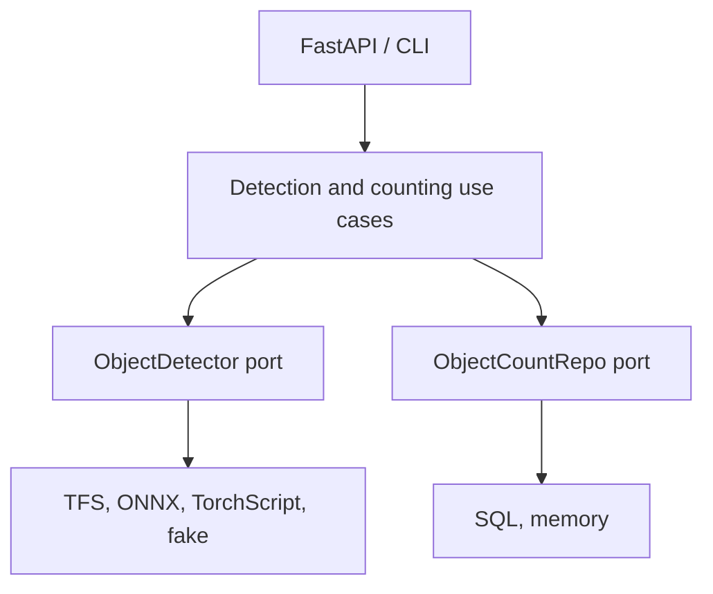

# Architecture

The service uses ports and adapters. Domain code owns the detection and counting
contracts; infrastructure code implements them.



`counter/bootstrap.py` is the composition root. The domain does not import the
web framework, SQLAlchemy, Pillow, HTTP clients, or inference runtimes.

## Request path

For `POST /object-count`:

1. Request middleware assigns or validates the request ID.
2. The body guard rejects an oversized declared payload.
3. The route reads the upload in bounded chunks and validates the threshold.
4. The model is resolved and inference runs in a worker thread.
5. The detector returns normalized domain predictions.
6. The use case filters by threshold and groups by class.
7. The repository atomically increments the model-version totals.
8. The response schema returns current and accumulated counts.

Blocking model loading, inference, and SQL work do not run on the event loop.

## Persistence

The deployed schema uses this primary key:

```text
(model_name, model_version, object_class)
```

PostgreSQL, SQLite, and MySQL use their native upsert form. The update increments
the stored count in one statement. The in-memory adapter protects the same
operation with a lock.

PostgreSQL is the production target. SQLite is useful for local tests but does
not replace the PostgreSQL concurrency test.

## Model selection

The model catalog declares:

- public API name and version
- framework
- label map
- endpoint or artifact
- preprocessing contract
- backend thresholds

The registry loads in-process models on first use and caches them. TensorFlow
Serving remains remote. Callers select a model with `model_name`; responses
include both model name and version.

## Health behavior

`/healthz` only verifies that the process can answer. It does not restart a
healthy process during a database or model outage.

`/readyz` verifies the migrated repository and the default detector. The TFS
adapter checks model status and requires an available version.

## Tradeoffs

- Remote TFS separates API and model scaling but adds network and JSON encoding.
- In-process ONNX or TorchScript removes that hop but loads weights into each API
  replica.
- Lazy loading reduces idle memory but makes the first request slower.
- REST routes are async, while blocking dependencies use the thread pool. A
  fully async database stack would add complexity without making CPU-bound
  inference asynchronous.

The relevant decisions are recorded under [`docs/adr`](adr/).
